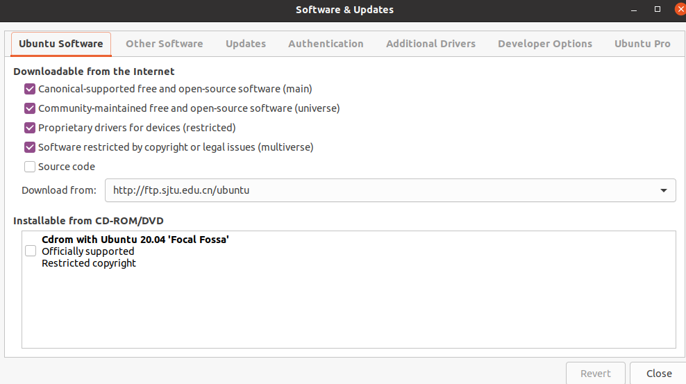
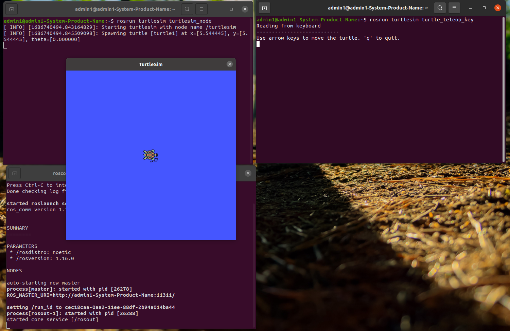

# 资料

[autolabor](http://www.autolabor.com.cn/book/ROSTutorials/chapter1/12-roskai-fa-gong-ju-an-zhuang/124-an-zhuang-ros.html)


# 1. 安装ROS

## 0. 准备工作

**一台20.04ubuntu的电脑**


配置ubuntu的软件和更新

打开`software & update`后按照下图进行配置（确保勾选了"restricted"， "universe，" 和 "multiverse."）




## 1. 设置安装源

这里直接使用国内中科大的安装源，安装更快

```bash
sudo sh -c '. /etc/lsb-release && echo "deb http://mirrors.ustc.edu.cn/ros/ubuntu/ `lsb_release -cs` main" > /etc/apt/sources.list.d/ros-latest.list'
```


## 2. 设置Key

```bash
sudo apt-key adv --keyserver 'hkp://keyserver.ubuntu.com:80' --recv-key C1CF6E31E6BADE8868B172B4F42ED6FBAB17C654
```


## 3. 安装

首先更新apt

```bash
sudo apt update
```


更新好之后安装最为常用的`Desktop-Full`版本，注意：这里的`noetic`适配的是20.02的ubuntu。

```bash
sudo apt install ros-noetic-desktop-full
```


安装的时候由于网络问题可能会失败，这里反复调用更新和安装命令，直到成功。


## 4. 配置环境变量

配置环境变量，方便在任意终端中使用ROS

```bash
echo "source /opt/ros/noetic/setup.bash" >> ~/.bashrc
source ~/.bashrc
```


## 5. 卸载(optional)

```bash
sudo apt remove ros-noetic-*
```


## 6. rosdep的安装

`rosdep`是一个用来安装`ros`所需依赖包的工具

`noetic`安装的时候没有构建，现在还用不上，这里先不管


# 2. 测试ROS

## 经典小乌龟测试

启动三个命令行，分别输入一下三个命令：

1. `roscore`，ros核心
2. `rosrun turtlesim turtlesim_node`，此时会弹出图形化界面
3. `rosrun turtlesim turtle_teleop_key`，在这个终端中通过上下左右键控制2中的乌龟

