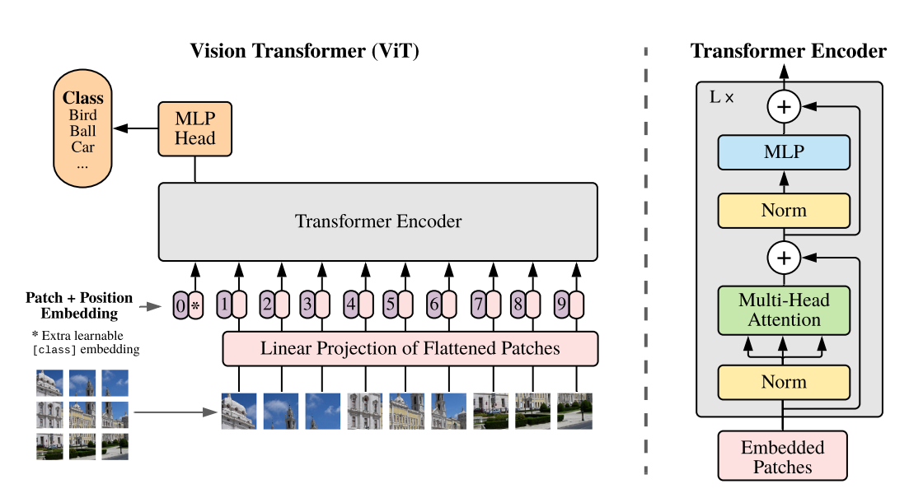
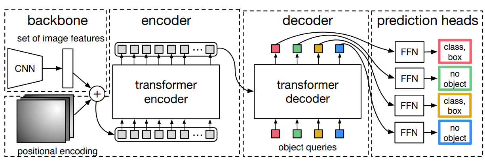
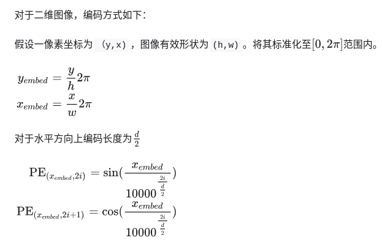
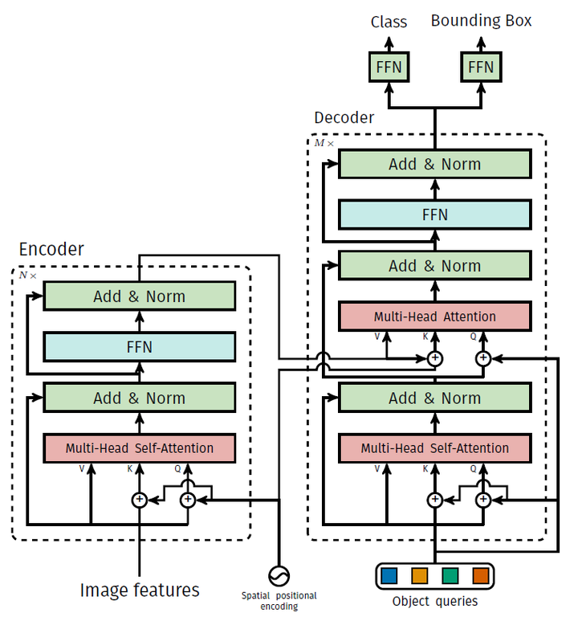

## DETR

前情提要：

​	DETR和ViT并不一样，具体来说：

 1. ViT只是利用Transformer中的Encoder对裁剪好的图像特征进一步编码，最后进行图像分类任务。

    

 2. DETR则以提取出来的图像特征作为输入，使用Transformer中的Encoder-Decoder架构进行目标检测任务。

    

### Position Embedding

具体实现如下：



```python
def forward(self, tensor_list: NestedTensor):
    x = tensor_list.tensors
    mask = tensor_list.mask
    # 此时mask为填充掩膜，将其取反得到有效区域的掩膜
    assert mask is not None
    not_mask = ~mask
    # 计算此时竖直方向上的坐标
    y_embed = not_mask.cumsum(1, dtype=torch.float32)
    # 计算此时水平方向上的坐标
    x_embed = not_mask.cumsum(2, dtype=torch.float32)
    if self.normalize:
        # 默认需要标准化
        eps = 1e-6
        # self.scale = 2*\pi
        y_embed = y_embed / (y_embed[:, -1:, :] + eps) * self.scale
        x_embed = x_embed / (x_embed[:, :, -1:] + eps) * self.scale
    # self.num_pos_feats = d/2
    dim_t = torch.arange(self.num_pos_feats, dtype=torch.float32, device=x.device)
    # 计算编码函数中的分母，temperature=10000，2*(dim_t//2)就是公式中的2i，无论此时为2i还是2i+1都不改变分母的值
    dim_t = self.temperature ** (2 * (dim_t // 2) / self.num_pos_feats)

    # 计算水平、竖直方向的位置编码
    pos_x = x_embed[:, :, :, None] / dim_t
    pos_y = y_embed[:, :, :, None] / dim_t
    # 将编码分奇偶取出，并交叉合并成一维
    pos_x = torch.stack((pos_x[:, :, :, 0::2].sin(), pos_x[:, :, :, 1::2].cos()), dim=4).flatten(3)
    pos_y = torch.stack((pos_y[:, :, :, 0::2].sin(), pos_y[:, :, :, 1::2].cos()), dim=4).flatten(3)
    # 最后将竖直、水平编码合并
    pos = torch.cat((pos_y, pos_x), dim=3).permute(0, 3, 1, 2)
    
    return pos
```

**由于训练时，会有利用padding来处理输入的情况，所以DETR也有`padding mask`，但没有`atten mask`。**

### DETR Pipeline

```python
def forward(self, samples: NestedTensor):

    if isinstance(samples, (list, torch.Tensor)):
        samples = nested_tensor_from_tensor_list(samples)
    # 1.提取图像特征
    features, pos = self.backbone(samples)

    src, mask = features[-1].decompose()
    assert mask is not None
    # 2.进入Encoder-Decoder，利用object query进行交互
    hs = self.transformer(self.input_proj(src), mask, self.query_embed.weight, pos[-1])[0]
	# 3.利用线性层对最后解码出来的特征进行分类和边界框回归
    outputs_class = self.class_embed(hs)
    outputs_coord = self.bbox_embed(hs).sigmoid()
    out = {'pred_logits': outputs_class[-1], 'pred_boxes': outputs_coord[-1]}
    if self.aux_loss:
        out['aux_outputs'] = self._set_aux_loss(outputs_class, outputs_coord)
    return out
```

### Transformer Pipeline

```python
def forward(self, src, mask, query_embed, pos_embed):
    # flatten NxCxHxW to HWxNxC
    bs, c, h, w = src.shape  # NxCxHxW 
    src = src.flatten(2).permute(2, 0, 1)  # HWxNxC
    # 2d position embedding
    pos_embed = pos_embed.flatten(2).permute(2, 0, 1)
    # object query
    query_embed = query_embed.unsqueeze(1).repeat(1, bs, 1)
    # padding mask
    mask = mask.flatten(1)
    # 初始化object query为0
    tgt = torch.zeros_like(query_embed)
    # encoder和decoder都只使用了padding mask
    memory = self.encoder(src, src_key_padding_mask=mask, pos=pos_embed)
    hs = self.decoder(tgt, memory, memory_key_padding_mask=mask,
                      pos=pos_embed, query_pos=query_embed)
    return hs.transpose(1, 2), memory.permute(1, 2, 0).view(bs, c, h, w)
```

其中Encoder和Decoder都和普通的Transformer类似。

细微差别如下图所示：

[图片出处](https://zhuanlan.zhihu.com/p/495598697)

