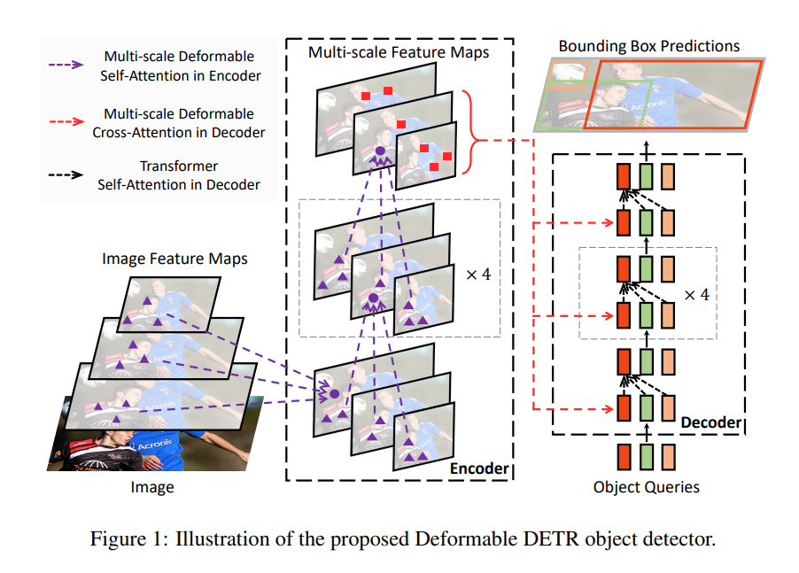

## Deformable DETR

[参考博客](https://blog.csdn.net/qq_38253797/article/details/127668593)



### Backbone

#### Multi-Scale features

多尺度特征

```python
def forward(self, tensor_list: NestedTensor):
    # 输入特征图  [bs, C, H, W]  ->  返回ResNet50中 layer2 layer3 layer4层的输出特征图
    # 0 = [bs, 512, H/8, W/8]  1 = [bs, 1024, H/16, W/16]  2 = [bs, 2048, H/32, W/32]
    xs = self.body(tensor_list.tensors)
    out: Dict[str, NestedTensor] = {}
    for name, x in xs.items():
        m = tensor_list.mask
        assert m is not None
        # 原图片mask下采样8、16、32倍
        mask = F.interpolate(m[None].float(), size=x.shape[-2:]).to(torch.bool)[0]
        out[name] = NestedTensor(x, mask)
    # 3个不同尺度的输出特征和mask  dict: 3
    # 0: tensors[bs, 512, H/8, W/8]  mask[bs, H/8, W/8]
    # 1: tensors[bs, 1024, H/16, W/16]  mask[bs, H/16, W/16]
    # 3: tensors[bs, 2048, H/32, W/32]  mask[bs, H/32, W/32]
    return out
```

#### Multi-Scale Position Embedding

```python
class DeformableTransformer(nn.Module):
    def __init__(self, d_model=256, nhead=8,
                 num_encoder_layers=6, num_decoder_layers=6, dim_feedforward=1024, dropout=0.1,
                 activation="relu", return_intermediate_dec=False,
                 num_feature_levels=4, dec_n_points=4,  enc_n_points=4,
                 two_stage=False, two_stage_num_proposals=300):
        super().__init__()
        ...
        # scale-level position embedding  [4, 256]  可学习的
        # 因为deformable detr用到了多尺度特征  经过backbone会生成4个不同尺度的特征图  但是如果还是使用原先的sine position embedding
        # detr是针对h和w进行编码的 不同位置的特征点会对应不同的编码值
        # 但是deformable detr不同的特征图的不同位置就有可能会产生相同的位置编码，就无法区分了
        # 为了解决这个问题，这里引入level_embed这个遍历  不同层的特征图会有不同的level_embed 再让原先的每层位置编码+每层的level_embed
        # 这样就很好的区分不同层的位置编码了  而且这个level_embed是可学习的
        self.level_embed = nn.Parameter(torch.Tensor(num_feature_levels, d_model))
        ...
	def forward(self, srcs, masks, pos_embeds, query_embed=None):
		...
		for lvl, (src, mask, pos_embed) in enumerate(zip(srcs, masks, pos_embeds)):
			# pos_embed: detr的位置编码 仅仅可以区分h,w的位置 因此对应不同的特征图有相同的h、w位置的话，是无法区分的
            pos_embed = pos_embed.flatten(2).transpose(1, 2)  # [bs,c,h,w] -> [bs,hxw,c]
            # scale-level position embedding  [bs,hxw,c] + [1,1,c] -> [bs,hxw,c]
            # 每一层所有位置加上相同的level_embed 且 不同层的level_embed不同
            # 所以这里pos_embed + level_embed，这样即使不同层特征有相同的w和h，那么也会产生不同的lvl_pos_embed  这样就可以区分了
            lvl_pos_embed = pos_embed + self.level_embed[lvl].view(1, 1, -1)
```

### Multi-Scale Deformable Attention

#### Reference Points

```python
    @staticmethod
    def get_reference_points(spatial_shapes, valid_ratios, device):
        """
        生成参考点   reference points  为什么参考点是中心点？  为什么要归一化？
        spatial_shapes: 4个特征图的shape [4, 2]
        valid_ratios: 4个特征图中非padding部分的边长占其边长的比例  [bs, 4, 2]  如全是1
        device: cuda:0
        """
        reference_points_list = []
        # 遍历4个特征图的shape  比如 H_=100  W_=150
        for lvl, (H_, W_) in enumerate(spatial_shapes):
            # 0.5 -> 99.5 取100个点  0.5 1.5 2.5 ... 99.5
            # 0.5 -> 149.5 取150个点 0.5 1.5 2.5 ... 149.5
            # ref_y: [100, 150]  第一行：150个0.5  第二行：150个1.5 ... 第100行：150个99.5
            # ref_x: [100, 150]  第一行：0.5 1.5...149.5   100行全部相同
            ref_y, ref_x = torch.meshgrid(torch.linspace(0.5, H_ - 0.5, H_, dtype=torch.float32, device=device),
                                          torch.linspace(0.5, W_ - 0.5, W_, dtype=torch.float32, device=device))
            # [100, 150] -> [bs, 15000]  150个0.5 + 150个1.5 + ... + 150个99.5 -> 除以100 归一化
            ref_y = ref_y.reshape(-1)[None] / (valid_ratios[:, None, lvl, 1] * H_)
            # [100, 150] -> [bs, 15000]  100个: 0.5 1.5 ... 149.5  -> 除以150 归一化
            ref_x = ref_x.reshape(-1)[None] / (valid_ratios[:, None, lvl, 0] * W_)
            # [bs, 15000, 2] 每一项都是xy
            ref = torch.stack((ref_x, ref_y), -1)
            reference_points_list.append(ref)
        # list4: [bs, H/8*W/8, 2] + [bs, H/16*W/16, 2] + [bs, H/32*W/32, 2] + [bs, H/64*W/64, 2] ->
        # [bs, H/8*W/8+H/16*W/16+H/32*W/32+H/64*W/64, 2]
        reference_points = torch.cat(reference_points_list, 1)
        # reference_points: [bs, H/8*W/8+H/16*W/16+H/32*W/32+H/64*W/64, 2] -> [bs, H/8*W/8+H/16*W/16+H/32*W/32+H/64*W/64, 1, 2]
        # valid_ratios: [1, 4, 2] -> [1, 1, 4, 2]
        # 复制4份 每个特征点都有4个归一化参考点 -> [bs, H/8*W/8+H/16*W/16+H/32*W/32+H/64*W/64, 4, 2]
        reference_points = reference_points[:, :, None] * valid_ratios[:, None]
        # 4个flatten后特征图的归一化参考点坐标
        return reference_points
```

#### MSDeformAttn

对于可变形注意力机制来说，Q是嵌入有多尺度位置编码的多尺度特征图，K是参考点坐标，V是多尺度特征图。

实际过程是：

1. 由Q经过线性变换得到采样点偏移量和注意力权重
2. 采样点(x, y) = 提前预设的参考点 + 偏移量**（偏移量可以学习）**
3. 根据采样点的坐标，利用双线性采样得到对应的value，并与对应的注意力权重相乘后求和

```python
class MSDeformAttn(nn.Module):
    def __init__(self, d_model=256, n_levels=4, n_heads=8, n_points=4):
        """
        Multi-Scale Deformable Attention Module
        :param d_model      hidden dimension
        :param n_levels     number of feature levels
        :param n_heads      number of attention heads
        :param n_points     number of sampling points per attention head per feature level
        """
        super().__init__()
        if d_model % n_heads != 0:
            raise ValueError('d_model must be divisible by n_heads, but got {} and {}'.format(d_model, n_heads))
        _d_per_head = d_model // n_heads
        # you'd better set _d_per_head to a power of 2 which is more efficient in our CUDA implementation
        if not _is_power_of_2(_d_per_head):
            warnings.warn("You'd better set d_model in MSDeformAttn to make the dimension of each attention head a power of 2 "
                          "which is more efficient in our CUDA implementation.")

        self.im2col_step = 64        # 用于cuda算子
        self.d_model = d_model       # 特征层channel = 256
        self.n_levels = n_levels     # 多尺度特征 特征个数 = 4
        self.n_heads = n_heads       # 多头 = 8
        self.n_points = n_points     # 采样点个数 = 4

        # 采样点的坐标偏移offset
        # 每个query在每个注意力头和每个特征层都需要采样n_points=4个采样点 每个采样点2D坐标 xy = 2  ->  n_heads * n_levels * n_points * 2 = 256
        self.sampling_offsets = nn.Linear(d_model, n_heads * n_levels * n_points * 2)
        # 每个query对应的所有采样点的注意力权重  n_heads * n_levels * n_points = 8x8x4=128
        self.attention_weights = nn.Linear(d_model, n_heads * n_levels * n_points)
        # 线性变换得到value
        self.value_proj = nn.Linear(d_model, d_model)
        # 最后的线性变换得到输出结果
        self.output_proj = nn.Linear(d_model, d_model)

        self._reset_parameters()   # 生成初始化的偏置位置 + 注意力权重初始化

    def _reset_parameters(self):
        # 生成初始化的偏置位置 + 注意力权重初始化
        constant_(self.sampling_offsets.weight.data, 0.)
        # [8, ]  0, pi/4, pi/2, 3pi/4, pi, 5pi/4, 3pi/2, 7pi/4
        thetas = torch.arange(self.n_heads, dtype=torch.float32) * (2.0 * math.pi / self.n_heads)
        # [8, 2]
        grid_init = torch.stack([thetas.cos(), thetas.sin()], -1)
        # [n_heads, n_levels, n_points, xy] = [8, 4, 4, 2]
        grid_init = (grid_init / grid_init.abs().max(-1, keepdim=True)[0]).view(self.n_heads, 1, 1, 2).repeat(1, self.n_levels, self.n_points, 1)
        # 同一特征层中不同采样点的坐标偏移肯定不能够一样  因此这里需要处理
        # 对于第i个采样点，在8个头部和所有特征层中，其坐标偏移为：
        # (i,0) (i,i) (0,i) (-i,i) (-i,0) (-i,-i) (0,-i) (i,-i)   1<= i <= n_points
        # 从图形上看，形成的偏移位置相当于3x3正方形卷积核 去除中心 中心是参考点
        for i in range(self.n_points):
            grid_init[:, :, i, :] *= i + 1
        with torch.no_grad():
            # 把初始化的偏移量的偏置bias设置进去  不计算梯度
            self.sampling_offsets.bias = nn.Parameter(grid_init.view(-1))
        constant_(self.attention_weights.weight.data, 0.)
        constant_(self.attention_weights.bias.data, 0.)
        xavier_uniform_(self.value_proj.weight.data)
        constant_(self.value_proj.bias.data, 0.)
        xavier_uniform_(self.output_proj.weight.data)
        constant_(self.output_proj.bias.data, 0.)

    def forward(self, query, reference_points, input_flatten, input_spatial_shapes, input_level_start_index, input_padding_mask=None):
        """
        【encoder】
        query: 4个flatten后的特征图+4个flatten后特征图对应的位置编码 = src_flatten + lvl_pos_embed_flatten
               [bs, H/8 * W/8 + H/16 * W/16 + H/32 * W/32 + H/64 * W/64, 256]
        reference_points: 4个flatten后特征图对应的归一化参考点坐标 每个特征点有4个参考点 xy坐标
                          [bs, H/8 * W/8 + H/16 * W/16 + H/32 * W/32 + H/64 * W/64, 4, 2]
        input_flatten: 4个flatten后的特征图=src_flatten  [bs, H/8 * W/8 + H/16 * W/16 + H/32 * W/32 + H/64 * W/64, 256]
        input_spatial_shapes: 4个flatten后特征图的shape [4, 2]
        input_level_start_index: 4个flatten后特征图对应被flatten后的起始索引 [4]  如[0,15100,18900,19850]
        input_padding_mask: 4个flatten后特征图的mask [bs, H/8 * W/8 + H/16 * W/16 + H/32 * W/32 + H/64 * W/64]
        """
        N, Len_q, _ = query.shape  # bs   query length(每张图片所有特征点的数量)
        N, Len_in, _ = input_flatten.shape   # bs   query length(每张图片所有特征点的数量)
        assert (input_spatial_shapes[:, 0] * input_spatial_shapes[:, 1]).sum() == Len_in

        # value = w_v * x  通过线性变换将输入的特征图变换成value  [bs, Len_q, 256] -> [bs, Len_q, 256]
        value = self.value_proj(input_flatten)
        # 将特征图mask过的地方（无效地方）的value用0填充
        if input_padding_mask is not None:
            value = value.masked_fill(input_padding_mask[..., None], float(0))
        # 把value拆分成8个head      [bs, Len_q, 256] -> [bs, Len_q, 8, 32]
        value = value.view(N, Len_in, self.n_heads, self.d_model // self.n_heads)

        # 预测采样点的坐标偏移  [bs,Len_q,256] -> [bs,Len_q,256] -> [bs, Len_q, n_head, n_level, n_point, 2] = [bs, Len_q, 8, 4, 4, 2]
        sampling_offsets = self.sampling_offsets(query).view(N, Len_q, self.n_heads, self.n_levels, self.n_points, 2)
        # 预测采样点的注意力权重  [bs,Len_q,256] -> [bs,Len_q, 128] -> [bs, Len_q, 8, 4*4]
        attention_weights = self.attention_weights(query).view(N, Len_q, self.n_heads, self.n_levels * self.n_points)
        # 每个query在每个注意力头部内，每个特征层都采样4个特征点，即16个采样点(4x4),再对这16个采样点的注意力权重进行初始化
        # [bs, Len_q, 8, 16] -> [bs, Len_q, 8, 16] -> [bs, Len_q, 8, 4, 4]
        attention_weights = F.softmax(attention_weights, -1).view(N, Len_q, self.n_heads, self.n_levels, self.n_points)

        # N, Len_q, n_heads, n_levels, n_points, 2
        if reference_points.shape[-1] == 2:    # one stage
            # [4, 2]  每个(h, w) -> (w, h)
            offset_normalizer = torch.stack([input_spatial_shapes[..., 1], input_spatial_shapes[..., 0]], -1)
            # [bs, Len_q, 1, n_point, 1, 2] + [bs, Len_q, n_head, n_level, n_point, 2] / [1, 1, 1, n_point, 1, 2]
            # -> [bs, Len_q, 1, n_levels, n_points, 2]
            # 参考点 + 偏移量/特征层宽高 = 采样点
            sampling_locations = reference_points[:, :, None, :, None, :] \
                                 + sampling_offsets / offset_normalizer[None, None, None, :, None, :]
        elif reference_points.shape[-1] == 4:  # two stage  +  iterative bounding box refinement
            # 前两个是xy 后两个是wh
            # 初始化时offset是在 -n_points ~ n_points 范围之间 这里除以self.n_points是相当于把offset归一化到 0~1
            # 然后再乘以宽高的一半 再加上参考点的中心坐标 这就相当于使得最后的采样点坐标总是位于proposal box内
            # 相当于对采样范围进行了约束 减少了搜索空间
            sampling_locations = reference_points[:, :, None, :, None, :2] \
                                 + sampling_offsets / self.n_points * reference_points[:, :, None, :, None, 2:] * 0.5
        else:
            raise ValueError(
                'Last dim of reference_points must be 2 or 4, but get {} instead.'.format(reference_points.shape[-1]))
        # 输入：采样点位置、注意力权重、所有点的value
        # 具体过程：根据采样点位置从所有点的value中拿出对应的value，并且和对应的注意力权重进行weighted sum
        # 调用CUDA实现的MSDeformAttnFunction函数  需要编译
        # [bs, Len_q, 256]
        output = MSDeformAttnFunction.apply(
            value, input_spatial_shapes, input_level_start_index, sampling_locations, attention_weights, self.im2col_step)
        # 最后进行公式中的线性运算
        # [bs, Len_q, 256]
        output = self.output_proj(output)
        return output
```

#### MSDeformAttnFunction

```python
def ms_deform_attn_core_pytorch(value, value_spatial_shapes, sampling_locations, attention_weights):
    # for debug and test only,
    # need to use cuda version instead
    # value shape: [bs, Len_q, 8, 32]
    # Len_q = H/8 * W/8 + H/16 * W/16 + H/32 * W/32 + H/64 * W/64
    N_, S_, M_, D_ = value.shape
    _, Lq_, M_, L_, P_, _ = sampling_locations.shape
    # 把value分割到各个特征层上得到对应的 list value
    value_list = value.split([H_ * W_ for H_, W_ in value_spatial_shapes], dim=1)
    # 采样点坐标从[0,1] -> [-1, 1]  F.grid_sample要求采样坐标归一化到[-1, 1]
    sampling_grids = 2 * sampling_locations - 1
    sampling_value_list = []
    for lid_, (H_, W_) in enumerate(value_spatial_shapes):
        # N_, H_*W_, M_, D_ -> N_, H_*W_, M_*D_ -> N_, M_*D_, H_*W_ -> N_*M_, D_, H_, W_
        value_l_ = value_list[lid_].flatten(2).transpose(1, 2).reshape(N_*M_, D_, H_, W_)  # 得到每个特征层的value list
        # N_, Lq_, M_, P_, 2 -> N_, M_, Lq_, P_, 2 -> N_*M_, Lq_, P_, 2
        sampling_grid_l_ = sampling_grids[:, :, :, lid_].transpose(1, 2).flatten(0, 1)  # 得到每个特征层的采样点 list
        # N_*M_, D_, Lq_, P_  采样算法  根据每个特征层采样点到每个特征层的value进行采样  非采样点用0填充
        sampling_value_l_ = F.grid_sample(value_l_, sampling_grid_l_,
                                          mode='bilinear', padding_mode='zeros', align_corners=False)
        sampling_value_list.append(sampling_value_l_)
    # (N_, Lq_, M_, L_, P_) -> (N_, M_, Lq_, L_, P_) -> (N_, M_, 1, Lq_, L_*P_)
    attention_weights = attention_weights.transpose(1, 2).reshape(N_*M_, 1, Lq_, L_*P_)
    # 注意力权重 和 采样后的value 进行 weighted sum
    output = (torch.stack(sampling_value_list, dim=-2).flatten(-2) * attention_weights).sum(-1).view(N_, M_*D_, Lq_)
    return output.transpose(1, 2).contiguous()
```

### Encoder

和普通的Encoder类似，不过由可变形注意力机制替换了原本的自注意力机制，具体维度变化参考前面的注释。

```python
def forward(self, src, pos, reference_points, spatial_shapes, level_start_index, padding_mask=None):
    """
    src: 展平的各层特征
    spatial_shapes: 各层特征图形状
    level_start_index: 各层首特征索引
    """
    # self attention
    # Q: src + pos, K: reference_points, V: src
    src2 = self.self_attn(self.with_pos_embed(src, pos), reference_points, src, spatial_shapes, level_start_index, padding_mask)
    src = src + self.dropout1(src2)
    src = self.norm1(src)

    # ffn
    src = self.forward_ffn(src)

    return src
```

### Decoder

和普通的Decoder类似，不过原本的交叉注意力机制也用可变形注意力机制进行替换。

```python
def forward(self, tgt, query_pos, reference_points, src, src_spatial_shapes, level_start_index, src_padding_mask=None):
    # self attention
    q = k = self.with_pos_embed(tgt, query_pos)
    tgt2 = self.self_attn(q.transpose(0, 1), k.transpose(0, 1), tgt.transpose(0, 1))[0].transpose(0, 1)
    tgt = tgt + self.dropout2(tgt2)
    tgt = self.norm2(tgt)

    # cross attention
    # self.cross_attn = MSDeformAttn(d_model, n_levels, n_heads, n_points)
    tgt2 = self.cross_attn(self.with_pos_embed(tgt, query_pos),
                           reference_points,
                           src, src_spatial_shapes, level_start_index, src_padding_mask)
    tgt = tgt + self.dropout1(tgt2)
    tgt = self.norm1(tgt)

    # ffn
    tgt = self.forward_ffn(tgt)

    return tgt
```

### 改进策略

#### Iterative Bounding Box Refinement

