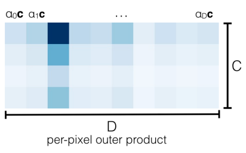

源码解读参考：[链接](https://blog.csdn.net/zyw2002/article/details/128319169)

fork后的项目地址：[github_project](https://github.com/Like2021/lift-splat-shoot)

ConvNeXt项目地址：[github_project](https://github.com/facebookresearch/ConvNeXt)

ConvNeXt v2博客上的个人实现：[CSDN_Link](https://blog.csdn.net/qq_42076902/article/details/129938723?spm=1001.2101.3001.6650.4&utm_medium=distribute.pc_relevant.none-task-blog-2%7Edefault%7EYuanLiJiHua%7EPosition-4-129938723-blog-124078407.235%5Ev32%5Epc_relevant_increate_t0_download_v2_base&depth_1-utm_source=distribute.pc_relevant.none-task-blog-2%7Edefault%7EYuanLiJiHua%7EPosition-4-129938723-blog-124078407.235%5Ev32%5Epc_relevant_increate_t0_download_v2_base&utm_relevant_index=9)


# 环境搭建

*Lift_Splat_Shoot环境*

```bash
# 1.创建环境
conda create -n LSS python=3.6

# 2.安装torch
pip install torch==1.8.0+cu111 torchvision==0.9.0+cu111 torchaudio==0.8.0 -f https://download.pytorch.org/whl/torch_stable.html

# 3.安装依赖
pip install nuscenes-devkit tensorboardX efficientnet_pytorch==0.7.0
```


*ConvNeXt环境*

```bash
# 安装依赖
pip install timm==0.3.2 tensorboardX six
```


# 代码阅读

## 1. `LiftSplatShoot`类

**先看初始化函数：**

`grid_conf`, `data_aug_conf`, `outC`均为初始化传参

分别是网格大小设置、数据预处理设置，和最后`BevEncode`的输出通道数


```python
class LiftSplatShoot(nn.Module):
    def __init__(self, grid_conf, data_aug_conf, outC):
        super(LiftSplatShoot, self).__init__()
        self.grid_conf = grid_conf
        self.data_aug_conf = data_aug_conf

        dx, bx, nx = gen_dx_bx(self.grid_conf['xbound'],
                                              self.grid_conf['ybound'],
                                              self.grid_conf['zbound'],
                                              )
        self.dx = nn.Parameter(dx, requires_grad=False)
        self.bx = nn.Parameter(bx, requires_grad=False)
        self.nx = nn.Parameter(nx, requires_grad=False)

        self.downsample = 16  # 下采样倍数
        self.camC = 64
        self.frustum = self.create_frustum()  # 创建视锥的函数
        self.D, _, _, _ = self.frustum.shape
        self.camencode = CamEncode(self.D, self.camC, self.downsample)
        self.bevencode = BevEncode(inC=self.camC, outC=outC)

        # toggle using QuickCumsum vs. autograd
        self.use_quickcumsum = True
```


**再看创建视锥的函数`create_frustum()`：**

目的是创建与图像视图编码器的输出特征图对应的**坐标点**，是经过编码的2D图像特征的坐标点


```python
def create_frustum(self):
    # make grid in image plane
    # 首先拿到输入特征图的大小
    ogfH, ogfW = self.data_aug_conf['final_dim']
    # 根据下采样倍数，得到图像视图编码器的输出特征图大小
    fH, fW = ogfH // self.downsample, ogfW // self.downsample
    
    ds = torch.arange(*self.grid_conf['dbound'], dtype=torch.float).view(-1, 1, 1).expand(-1, fH, fW)
    # D = 41
    D, _, _ = ds.shape
    xs = torch.linspace(0, ogfW - 1, fW, dtype=torch.float).view(1, 1, fW).expand(D, fH, fW)
    ys = torch.linspace(0, ogfH - 1, fH, dtype=torch.float).view(1, fH, 1).expand(D, fH, fW)

    # D x H x W x 3
    # 视锥创建为：41 × 8 × 22 × 3
    # 3依次代表 x,y,d
    frustum = torch.stack((xs, ys, ds), -1)
    # 最后返回视锥
    return nn.Parameter(frustum, requires_grad=False)
```


**然后是`get_geometry()`：**

将创建的视锥，即2D图像特征的坐标点，从图像坐标系转换到世界坐标系，这里的世界坐标系就是**以自车为中心的3D坐标系**


```python
def get_geometry(self, rots, trans, intrins, post_rots, post_trans):
    """Determine the (x,y,z) locations (in the ego frame)
    of the points in the point cloud.
    Returns B x N x D x H/downsample x W/downsample x 3
    """
    B, N, _ = trans.shape

    # undo post-transformation
    # B x N x D x H x W x 3
    # 首先把创建好的视锥减去数据增强的那些影响（旋转和平移）
    points = self.frustum - post_trans.view(B, N, 1, 1, 1, 3)
    points = torch.inverse(post_rots).view(B, N, 1, 1, 1, 3, 3).matmul(points.unsqueeze(-1))

    # cam_to_ego
    # 这里是关键：
    # points[:, :, :, :, :, :2]就是(x,y)
    # points[:, :, :, :, :, 2:3]就是d
    # 这里就是为了得到(x*d, y*d, d)
    points = torch.cat((points[:, :, :, :, :, :2] * points[:, :, :, :, :, 2:3],
                        points[:, :, :, :, :, 2:3]
                        ), 5)
    
    # d[x, y, 1]^T = intrins * rots^-1 * ([X, Y, Z]^T - trans)
    # 即[X, Y, Z]^T = rots^-1 * intrins^-1 * d[x, y, 1]^T + trans
    # 下面就是按公式求的
    
    # 这里就是生成变换矩阵，可以看上面的公式
    # 先把intrins转置，然后乘rots
    combine = rots.matmul(torch.inverse(intrins))
    
    # 然后就是将2D的坐标转换为3D的坐标
    points = combine.view(B, N, 1, 1, 1, 3, 3).matmul(points).squeeze(-1)
    # 在加上转换变量
    points += trans.view(B, N, 1, 1, 1, 3)

    return points
```


**再看`get_cam_feats()`：**

```python
def get_cam_feats(self, x):
    """Return B x N x D x H/downsample x W/downsample x C
    """
    B, N, C, imH, imW = x.shape
    
	# 把每个相机和每个批量乘起来，方便下面直接放入图像编码器中，其实就是把放入图像编码器的batch_size = B*N
    x = x.view(B*N, C, imH, imW)
    
    # 经过camencode之后,得到(B*N, 64, 41, H/16, W/16)
    x = self.camencode(x)
    
    # 把B*N拆开
    x = x.view(B, N, self.camC, self.D, imH//self.downsample, imW//self.downsample)
    
    # 调整一下顺序 (B,N,D,H,W,C)，把这个C放到最后，主要是为了后面voxel_pooling函数好操作
    x = x.permute(0, 1, 3, 4, 5, 2)
    
    return x
```


**在之后就是`voxel_pooling()`：**

这个函数就是把升维之后的特征弄成BEV的形式

这里的展平升维后的特征，可以看这个图：




```python
def voxel_pooling(self, geom_feats, x):
    B, N, D, H, W, C = x.shape
    Nprime = B*N*D*H*W

    # flatten x
    x = x.reshape(Nprime, C)

    # flatten indices
    # 将[-50,50] [-10 10]的范围平移到[0,100] [0,20]，计算栅格坐标并取整
    geom_feats = ((geom_feats - (self.bx - self.dx/2.)) / self.dx).long()
    
    # 把对应的坐标也都展平
    geom_feats = geom_feats.view(Nprime, 3)
    
    # 计算batch索引,因为展平里面也包含了不同batch的特征，不同batch就是不同帧，得分开，
    batch_ix = torch.cat([torch.full([Nprime//B, 1], ix,
                         device=x.device, dtype=torch.long) for ix in range(B)])
    
    # 把batch索引也合并到坐标索引中，变成(Nprime, 4)  X,Y,Z,B_id
    geom_feats = torch.cat((geom_feats, batch_ix), 1)

    # filter out points that are outside box
    # 过滤掉在边界线之外的点 x:0~199  y: 0~199  z: 0
    kept = (geom_feats[:, 0] >= 0) & (geom_feats[:, 0] < self.nx[0])\
        & (geom_feats[:, 1] >= 0) & (geom_feats[:, 1] < self.nx[1])\
        & (geom_feats[:, 2] >= 0) & (geom_feats[:, 2] < self.nx[2])
    x = x[kept]
    geom_feats = geom_feats[kept]

    # get tensors from the same voxel next to each other
    # 给每一个点一个rank值，rank相等的点在同一个batch，并且在在同一个格子里面
    ranks = geom_feats[:, 0] * (self.nx[1] * self.nx[2] * B)\
        + geom_feats[:, 1] * (self.nx[2] * B)\
        + geom_feats[:, 2] * B\
        + geom_feats[:, 3]
    sorts = ranks.argsort()
    # 按照rank排序，这样rank相近的点就在一起了
    x, geom_feats, ranks = x[sorts], geom_feats[sorts], ranks[sorts]

    # cumsum trick
    if not self.use_quickcumsum:
        x, geom_feats = cumsum_trick(x, geom_feats, ranks)
    else:
        x, geom_feats = QuickCumsum.apply(x, geom_feats, ranks)

    # griddify (B x C x Z x X x Y)
    # 生成一个格栅图(B, C, 1, 200, 200)
    final = torch.zeros((B, C, self.nx[2], self.nx[0], self.nx[1]), device=x.device)
    # 池化之后的geom_feats还是X,Y,Z,B_id排列，所以这里就是用对应的索引重新排列池化后的特征
    # C维不用管，对应就是(B,:,Z,X,Y)
    final[geom_feats[:, 3], :, geom_feats[:, 2], geom_feats[:, 0], geom_feats[:, 1]] = x

    # collapse Z
    # 把Z维度压缩
    final = torch.cat(final.unbind(dim=2), 1)

    return final  # (B, camC, 200, 200) 就是 (Batch_size, 64, 200, 200)
```


后面就先不看了，其实整体思路就是生成完全和`Camencode`的输出特征图（经过外积之后的特征）的每个点对应的坐标信息，利用这个信息来当索引，通过筛除超过3D空间的点和堆积同一个3D格子的点，来填充3D空间，最后`cumsum_trick`。


# 代码魔改

## 1. 修改`BevEncode`

### 1. 加入注意力机制

参考链接：[知乎](https://zhuanlan.zhihu.com/p/99261200)

```python
class AttentionBevEncode(BevEncode):
    def __init__(self, inC, outC):
        super(AttentionBevEncode, self).__init__(inC=inC, outC=outC)  # 继承自BevEncode的初始化，并将inC和outC传入它的初始化函数
        
        # 通道-空间注意力机制
        # self.cAttention1 = ChannelAttention(self.inplanes)
        # self.sAttention1 = SpatialAttention()

        # LKA_Attention
        self.lka_attention1 = Attention(64)

        # self.cAttention2 = ChannelAttention(256)
        # self.sAttention2 = SpatialAttention()

        self.lka_attention2 = Attention(256)

    def forward(self, x):
        x = self.conv1(x)
        x = self.bn1(x)
        x = self.relu(x)

        # block前加入注意力机制
        # x = self.cAttention1(x) * x
        # x = self.sAttention1(x) * x
        x = self.lka_attention1(x) * x

        x1 = self.layer1(x)
        x = self.layer2(x1)
        x = self.layer3(x)

        # x = self.cAttention2(x) * x
        # x = self.sAttention2(x) * x
        x = self.lka_attention2(x) * x

        x = self.up1(x, x1)
        x = self.up2(x)

        return x
```

#### nuScenes验证集效果

1. 加入`CBAM`模块
2. 加入`LKA`模块

在`180000`个迭代的时候，`iou`达到了0.312


感觉没啥用

### 2. 加入RepLKNet

```python
from src.RepLKNet import create_RepLKNet31B


class RepLKNetBevEncode(BevEncode):
    def __init__(self, inC, outC):
        super(RepLKNetBevEncode, self).__init__(inC=inC, outC=outC)

        self.backbone = create_RepLKNet31B(small_kernel_merged=False)

        self.stage1 = self.backbone.stages[0]
        self.trans1 = self.backbone.transitions[0]

    def forward(self, x):
        x = self.conv1(x)
        x = self.bn1(x)
        x = self.relu(x)

        # resnet-18的两个编码层
        x1 = self.layer1(x)

        # 这个层会将尺寸图变成1/2
        x = self.layer2(x1)

        x = self.stage1(x)
        x = self.trans1(x)

        x = self.up1(x, x1)
        x = self.up2(x)

        return x
```


## 2. 修改`CamEncode`

### 1. `LKA`与`ConvNeXt`的结合

```python
class ConvnextCamEncode(CamEncode):
    def __init__(self, D, C, downsample):
        super(ConvnextCamEncode, self).__init__(D=D, C=C, downsample=downsample)

        self.backbone = convnext_tiny(True)
        # 总体channel变化：3 -> 96 -> 192 -> 384 -> 768
        self.channels = [96, 192]
        self.lka_attention1 = Attention(self.channels[0])
        self.lka_attention2 = Attention(self.channels[1])

        self.myUp = Up(384+768, 512)

    def get_eff_depth(self, x):
        # 保存特征图尺寸变化的层输出
        endpoints = dict()

        # 遍历stem下采样+stage
        for i in range(4):
            x = self.backbone.downsample_layers[i](x)
            if i == 0:
                x = self.lka_attention1(x)
            if i == 1:
                x = self.lka_attention2(x)
            x = self.backbone.stages[i](x)

            # 下采样1次之后保存
            endpoints['reduction_{}'.format(len(endpoints) + 1)] = x

        # 上采样+拼接
        x = self.myUp(endpoints['reduction_4'], endpoints['reduction_3'])

        return x
```


# 问题记录

## 1.`timm`和`torch`版本问题

尝试过`python v3.8 + torch v1.9+cu111`的组合，配上`timm v0.3.2`，

出现错误`ImportError: cannot import name 'container_abcs' from 'torch._six'`


**错误原因：**

参考：[链接](https://blog.csdn.net/qq_45064423/article/details/124233803)


## 2. Tensorboard的使用

需要关闭手动代理，否则打开浏览器会报错


## 3. 加入RepLKNet，默认使用`SyncBn`

报错`RuntimeError: Default process group has not been initialized, please make sure to call init_process_group.`

修改成False：`use_sync_bn=False`

```python
def create_RepLKNet31B(drop_path_rate=0.3, num_classes=1000, use_checkpoint=True, small_kernel_merged=False):
    return RepLKNet(large_kernel_sizes=[31,29,27,13], layers=[2,2,18,2], channels=[128,256,512,1024],
                    drop_path_rate=drop_path_rate, small_kernel=5, num_classes=num_classes, use_checkpoint=use_checkpoint,
                    small_kernel_merged=small_kernel_merged, use_sync_bn=False)
```


# 知识记录

## 1. 模型参数量统计

```python
# 设置cuda设备
device = torch.device("cuda:0" if torch.cuda.is_available() else "cpu")
# 实例化模型
model = LiftSplatShoot(grid_conf=grid_conf, data_aug_conf=data_aug_conf, outC=1).to(device)

# 模型所有参数
pytorch_total_params = sum(p.numel() for p in model.parameters())

# 模型可训练参数
trainable_pytorch_total_params1 = sum(p.numel() for p in model.bevencode.parameters() if p.requires_grad)
trainable_pytorch_total_params2 = sum(p.numel() for p in model.camencode.parameters() if p.requires_grad)
trainable_pytorch_total_params3 = sum(p.numel() for p in model.parameters() if p.requires_grad)
```


## 2. 注意力图可视化

