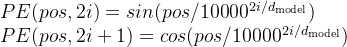

## Transformer

代码参考：https://github1s.com/Kyubyong/transformer/blob/master/model.py


解读参考：

https://zhuanlan.zhihu.com/p/368243631

https://zhuanlan.zhihu.com/p/372279569

[【Transformer】10分钟学会Transformer | Pytorch代码讲解 | 代码可运行](https://zhuanlan.zhihu.com/p/403433120#:~:text=2%20Transformer%20Encoder%E9%83%A8%E5%88%86%201%202%20.1%20Encoding%E8%BE%93%E5%85%A5%E9%83%A8%E5%88%86%EF%BC%88Positional%20Encoding%EF%BC%89,Layer%20normalization%20...%204%202.4%20Feed%20Forward%E5%89%8D%E9%A6%88%E7%A5%9E%E7%BB%8F%E7%BD%91%E7%BB%9C)

### Input

#### One-Hot Encoding

将文本，编码为`01`的矩阵。

#### Word Embedding

利用可学习的权重矩阵`W`进一步编码上述`01`矩阵。

具体实现如下：

```python
class Embeddings(nn.Module):
    def __init__(self, d_model, vocab):
        super(Embeddings, self).__init__()
		# Word Embedding
        self.lut = nn.Embedding(vocab, d_model)
        self.d_model = d_model

    def forward(self, x):
        # 结果乘以math.sqrt(self.d_model)，则保证后续加上位置编码之后，词编码的信息占比更大。
        return self.lut(x) * math.sqrt(self.d_model)
```

其中，*vocab* 代表词汇表中的单词量，one-hot 编码后词向量的长度就是这个值；*d_model*代表权重矩阵的列数，通常为512，就是要将词向量的维度从 *vocab 编码*到 *d_model*。

#### Position Embedding

对于`d_model`，偶数维使用*sin*函数，奇数维则使用*cos*函数，保证**不同位置在所有维度上不会被编码到完全一样的值**。

公式如下：



具体实现：

```python
class PositionalEncoding(nn.Module):
    def __init__(self, d_model, dropout, max_len=5000):
        super(PositionalEncoding, self).__init__()

        self.dropout = nn.Dropout(p=dropout)  
        pe = torch.zeros(max_len, d_model)  # max_len代表句子中最多有几个词
        position = torch.arange(0, max_len).unsqueeze(1)
        div_term = torch.exp(torch.arange(0, d_model, 2) * -(math.log(10000.0) / d_model))  # d_model即公式中的d
        pe[:, 0::2] = torch.sin(position * div_term)
        pe[:, 1::2] = torch.cos(position * div_term)
        pe = pe.unsqueeze(0)
        self.register_buffer('pe', pe)

    def forward(self, x):
        x = x + self.pe[:, :x.size(1)]  # 原向量加上计算出的位置信息才是最终的embedding
        return self.dropout(x)
```

因为这里的输入*x*已经是经过`Word Embedding`即线性变化之后的特征，所以这里直接相加即可实现“嵌入“。(具体分析可以靠参考博客)

#### Padding Mask

**由于输入维度可能不一致，需要进行padding**，但真正计算注意力的时候padding部分又是无意义的，这时就需要`Padding Mask`。

具体实现有很多种方式，这里只介绍一种常见的，对`softmax`之前的注意力得分进行`mask`：

[参考代码](https://github1s.com/harvardnlp/annotated-transformer/blob/master/the_annotated_transformer.py)

```python
def attention(query, key, value, mask=None, dropout=None):
    "Compute 'Scaled Dot Product Attention'"
    d_k = query.size(-1)
    scores = torch.matmul(query, key.transpose(-2, -1)) / math.sqrt(d_k)
    if mask is not None:
        # 给需要mask的对应特征赋一个接近-inf的值
        scores = scores.masked_fill(mask == 0, -1e9)
    # 在softmax之后，这个-1e9就会变成0，从而实现mask
    p_attn = scores.softmax(dim=-1)
    if dropout is not None:
        p_attn = dropout(p_attn)
    return torch.matmul(p_attn, value), p_attn
```

### Encoder

第1层的`Encoder`在得到输入后会对其做不同的线性变换分别生成**QKV**三个矩阵，再进行自注意力操作，后续的`Encoder`的输入则是前一个`Encoder`的输出。

#### Multi-Head Self-Attention

**“多头”的实现是将最后一个维度分割成多个，然后将其中每个独立作为“一个头”，所有头都处理完毕后，将分割出来的维度拼接在一起实现复原。**

一般是将**512**维拆分成**8**个头进行自注意力计算即`Scaled Dot-Product Attention`，然后将**8**个输出`cancat`。(注意最后线性变换之前有残差连接)

具体实现：

```python
# Linear projections
Q = tf.layers.dense(queries, d_model, use_bias=True) # (N, T_q, d_model)
K = tf.layers.dense(keys, d_model, use_bias=True) # (N, T_k, d_model)
V = tf.layers.dense(values, d_model, use_bias=True) # (N, T_k, d_model)

# Split and concat
Q_ = tf.concat(tf.split(Q, num_heads, axis=2), axis=0) # (h*N, T_q, d_model/h)
K_ = tf.concat(tf.split(K, num_heads, axis=2), axis=0) # (h*N, T_k, d_model/h)
V_ = tf.concat(tf.split(V, num_heads, axis=2), axis=0) # (h*N, T_k, d_model/h)

# Attention
outputs = scaled_dot_product_attention(Q_, K_, V_, key_masks, causality, dropout_rate, training)

# Restore shape
outputs = tf.concat(tf.split(outputs, num_heads, axis=0), axis=2 ) # (N, T_q, d_model)

# Residual connection
outputs += queries

# Normalize
outputs = ln(outputs)
```

#### Feed Forward Network and Add & Norm

经过自注意力计算后，再接一个前馈神经网络，并进行残差连接和层归一化。

```python
# Inner layer
outputs = tf.layers.dense(inputs, num_units[0], activation=tf.nn.relu)

# Outer layer
outputs = tf.layers.dense(outputs, num_units[1])

# Residual connection
outputs += inputs

# Normalize
outputs = ln(outputs)
```

### Decoder

第1层的`Decoder`的输入分别是`Encoder`的输出**Q**以及已解码的输入**KV**，后续的`Decoder`的输入则是前一个`Decoder`的输出。(每个`Decoder`都有两个多头注意力)

```python
    # Masked self-attention (Note that causality is True at this time)
    dec = multihead_attention(queries=dec,
                              keys=dec,
                              values=dec, ...)

    # Vanilla attention
    dec = multihead_attention(queries=dec,
                              keys=memory,
                              values=memory, ...)
    ### Feed Forward
    dec = ff(dec, num_units=[self.hp.d_ff, self.hp.d_model])
```

#### Attention Mask

由于`Mask`方法的特殊，这里单独拎出来。

这里的`Attention Mask`指的是`Decoder`中的操作，基本解释是：对于NLP训练，解码器只能看到前面的输入，但不能看到后面的输入，以这样的状态进行预测。

