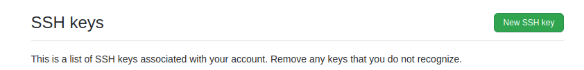
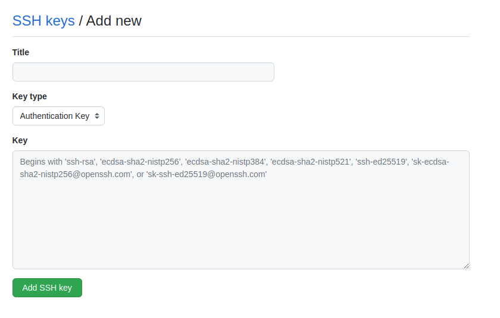

# 0 安装git

```bash
# 安装git
sudo apt-get install git

# 配置本地用户名
git config --global user.name "${your_github_name}"

# 配置邮箱
git config --global user.email "${your_email_of_github}"

# 检查配置信息
git config --global --list

# 确认无误后生成公钥，此时输出的内容会显示公钥的保存目录，默认是/home/用户名/.ssh/id_rsa.pub
ssh-keygen -t rsa -C "${your_email_of_github}"
```


在github->setting->SSH and GPG keys中new一个SSH key，




并在key中填入`id_rsa.pub`中的内容




```bash
# 检查配置是否成功
ssh -T git@github.com
```


# 1 本地新建仓库并推送到远程仓库

```shell
# 初始化仓库
git init

# 和远程仓库建立映射关系
git remote add origin ${repository_SSH}

# 增加要推送的文件
git add . 

# 提交commit
git commit -m "${your_description}"

# 推送项目到master分支
git push -u origin master
```


# 2 每日更新本地仓库到GitHub

```shell
# 添加修改到暂存区
git add ./

# 提交commit
git commit -m "${your_description}"

# 查看git状态
git status

# 推送修改
git push
```


# 3 管理分支

```shell
# 查看本地分支
git branch

# 查看远程分支
git branch -r

# 查看所有分支
git branch -a

# 本地创建新的分支
git branch ${new_branch_name}

# 切换到新分支
gir checkout ${new_branch_name}

# 创建并切换新分支
git checkout -b ${new_branch_name}

# 将本地创建的新分支推送到github仓库
git push origin ${new_branch_name}

# 删除本地分支
git branch -d ${new_branch_name}
# 当本地分支没被合并的时候，这样会提示你不能删除成功，用这个：
git branch -D ${new_branch_name}

# 删除github远程分支
git push origin :${new_branch_name}
```


# 4 将自己的修改添加到新的分支上

```shell
# 首先切换到新分支
git checkout ${new_branch_name}

# 添加本地需要提交的代码
git add .

# 提交本地代码
git commit -m "${your_description}"

# 提交到github新分支
git push origin ${new_branch_name}
```


# 5 当自己错误`add`或者`commit`，如何删除或修改

注：这个问题很恶心，有时候不小心把模型训练权重也`add`或者`commit`了，

但提交到远程仓库的时候就会很慢或者报错超过`100MB`了，所以不建议提交权重这类文件。

```shell
# 撤销commit，这里的HEAD^表示上一次的commit，
# 也可以写成HEAD~1，这也就代表可以通过修改数字，来删除上n次的commit
# 此外--soft 只撤销commit，不会撤销add
git reset --soft HEAD^

# 如果想一同撤销add
git reset --hard HEAD^

# 修改commit的注释
git commit --amend
# 然后进入vim编辑器，完成修改后，保存
```


# 6 合并某分支到当前分支

仓库中有主分支如`main`或`master`，另有开发分支如`dev`等

如确定需要将`dev`分支，合并到`main`主分支

```shell
# 切换到需要合并的分支
git checkout dev

# 再切换到主分支
git checkout main

# 进行合并
git merge dev

# 合并之后提交到main上
git push origin main
```


# 7 在非私人电脑上，利用HTTPS进行克隆，而非配置SSH

单独拉取需要的分支

```shell
git clone -b ${指定拉取的分支名} ${仓库对应的HTTPS}}
```

