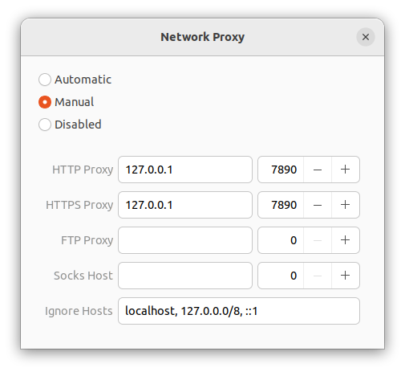
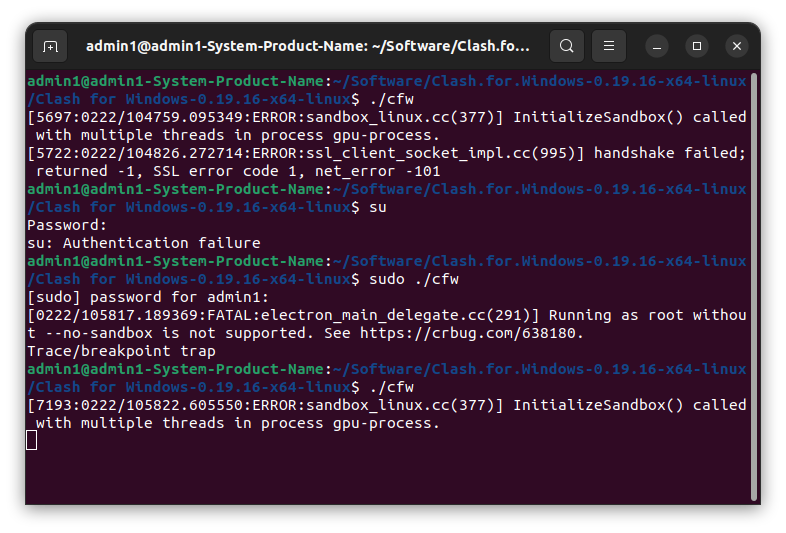
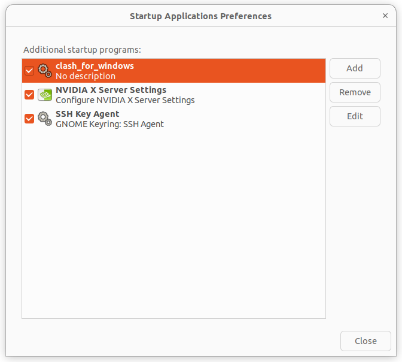
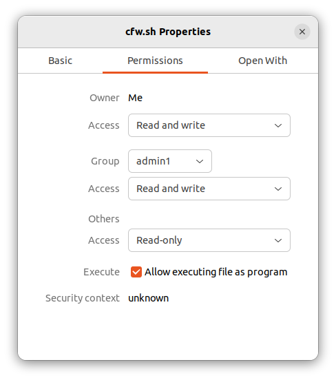

# 常用软件

下载.deb文件，然后使用dpkg进行安装

```bash
sudo dpkg -i {deb_file}
```

## Pycharm

前往官网下载好安装包，解压后

```bash
cd pycharm-community-2022.3.2/bin/

./pycharm.sh
```

## Anaconda

下载好安装包，用`bash`安装

```bash
bash ./Anaconda3-2022.10-Linux-x86_64.sh
```

## VS Code

直接在`ubuntu software`中安装，

首先安装`gcc，g++，gdb`

```bash
# 1.更新
sudo apt-get update

# 2.下载gcc,g++,gdb
sudo apt-get install gcc
sudo apt-get install g++
sudo apt-get install gdb

# 3.检查
gcc --version
g++ --version
```

然后配置`.vscode/launch.json`

<details>
    <summary>launch.json</summary>
{
    "version": "0.2.0",
    "configurations": [
        {
            "name": "C/C++",
            "type": "cppdbg",
            "request": "launch",
            "program": "${fileDirname}/${fileBasenameNoExtension}",
            "args": [],
            "stopAtEntry": false,
            "cwd": "${workspaceFolder}",
            "environment": [],
            "externalConsole": false,
            "MIMode": "gdb",
            "preLaunchTask": "compile",
            "setupCommands": [
                {
                    "description": "Enable pretty-printing for gdb",
                    "text": "-enable-pretty-printing",
                    "ignoreFailures": true
                }
            ]
        },
        {
            "name": "C/C++: g++ 生成和调试活动文件",
            "type": "cppdbg",
            "request": "launch",
            "program": "${fileDirname}/${fileBasenameNoExtension}",
            "args": [],
            "stopAtEntry": false,
            "cwd": "${fileDirname}",
            "environment": [],
            "externalConsole": true,
            "MIMode": "gdb",
            "setupCommands": [
                {
                    "description": "为 gdb 启用整齐打印",
                    "text": "-enable-pretty-printing",
                    "ignoreFailures": true
                },
                {
                    "description": "将反汇编风格设置为 Intel",
                    "text": "-gdb-set disassembly-flavor intel",
                    "ignoreFailures": true
                }
            ],
            "preLaunchTask": "C/C++: g++ 生成活动文件",
            "miDebuggerPath": "/usr/bin/gdb"
        }
    ]
}
</details>

和`.vscode/tasks.json`

<details>
    <summary>launch.json</summary>
{
    "version": "2.0.0",
    "tasks": [
        {
            "label": "compile",
            "command": "g++",
            "args": [
                "-g",
                "${file}",
                "-I",
                "${workspaceFolder}/include",
                "-o",
                "${fileDirname}/${fileBasenameNoExtension}"
            ],
            "problemMatcher": {
                "owner": "cpp",
                "fileLocation": [
                    "relative",
                    "${workspaceRoot}"
                ],
                "pattern": {
                    "regexp": "^(.*):(\\d+):(\\d+):\\s+(warning|error):\\s+(.*)$",
                    "file": 1,
                    "line": 2,
                    "column": 3,
                    "severity": 4,
                    "message": 5
                }
            },
            "group": "build"
        },
        {
            "type": "cppbuild",
            "label": "C/C++: g++ 生成活动文件",
            "command": "/usr/bin/g++",
            "args": [
                "-g",
                "${file}",
                "${workspaceFolder}/execute/**",
                "-o",
                "${fileDirname}/${fileBasenameNoExtension}",
                "-I",
                "${workspaceFolder}/include"
            ],
            "options": {
                "cwd": "${fileDirname}"
            },
            "problemMatcher": [
                "$gcc"
            ],
            "group": {
                "kind": "build",
                "isDefault": true
            },
            "detail": "调试器生成的任务。"
        }
    ]
}
</details>


# Googlepinyin

```bash
# 1.安装Fcitx
sudo apt-get install fcitx

# 2.配置Fcitx
im-config

# 3.重启
reboot

# 4.安装googlepinyin
sudo apt-get install fcitx-googlepinyin

# 5.配置输入法
fcitx-config-gtk3
```

最后如果没有，重启一下就好了

具体参考链接：http://t.csdn.cn/K8bae


# Clash for Windows

## 1.Install

自己的URL： https://api.touhou.center/link/IOlfRBcwgHIi41pV?clash=1

张sir的URL：https://line.stotik.com/link/u43QDXIZaiWLy1kp

**配置手动的代理**



最开始发现，v0.20.16 and v0.19.26都没用

出现问题：

```bash
/bin/sh: 1: kill: No such process

[4421:0222/103444.847045:ERROR:ssl_client_socket_impl.cc(997)] handshake failed; returned -1, SSL error code 1, net_error -101
```

随后换成v0.19.16

第一次启动没有用，只有左上角的流量监控和代理里边的延迟列表。

然后：



就可以用了，具体为什么解决无法分析，可能是因为这段时间外网被墙了？

并不是`sudo`或者`su`的原因，后续在新终端中开启也可以使用。

## 2.Setting

```bash
# 添加开机自启动
gnome-session-properties
```



通过add，添加写好的`cfw.sh`

```bash
#! /bin/bash

cd Software/Clash

./cfw
```

别忘了给cfw.sh添加权限，`Allow executing file as program`。




# Cuda and Cudnn

cuda参考：https://zhuanlan.zhihu.com/p/122286055

cudnn参考：http://t.csdn.cn/krk4M

## Cuda

### 1. Install

```bas
sudo chmod +x {cuda_your_version.run}
sudo ./{cuda_your_version.run}
```

出现下面这个错误，重装后没有gcc

```bas
Failed to verify gcc version. See log at /var/log/cuda-installer.log for details.
```

利用--override关键字强行安装

```ba
sudo ./{cuda_your_version.run} --override
```

### 2. Setting

打开.bashrc文件

```bash
sudo gedit ~/.bashrc
```

在最后插入：

```bash
export PATH="/usr/local/cuda-11.3/bin:$PATH"
export LD_LIBRARY_PATH="/usr/local/cuda-11.3/lib64:$LD_LIBRARY_PATH"
```

保存后，source一下

```bash
source ~/.bashrc
```

检查是否安装成功

```bash
nvcc -V
```

## Cudnn

下载好cudnn（版本和cuda对应匹配），进行解压，得到一个`cuda`的文件夹

```bash
tar -zxvf cudnn-11.3-linux-x64-v8.2.1.32.tgz
```

然后将`cuda`文件夹下的文件对应复制到`/usr/local/cuda-11.3/lib64/`和`/usr/local/cuda-11.3/include/`中

```bash
sudo cp cuda/lib64/* /usr/local/cuda-11.3/lib64/
sudo cp cuda/include/* /usr/local/cuda-11.3/include/
```

最后检查一下：

```bash
cat /usr/local/cuda-11.3/include/cudnn_version.h | grep CUDNN_MAJOR -A 2
```


