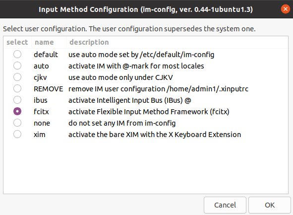
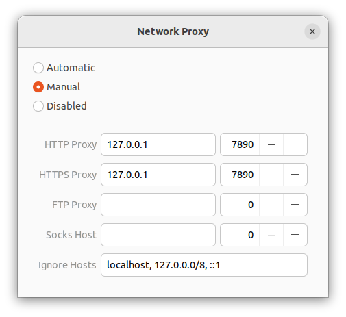
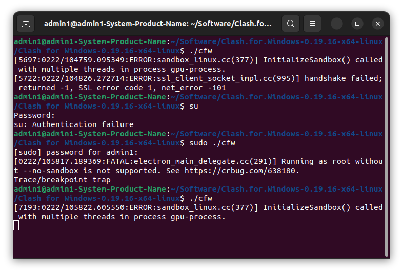
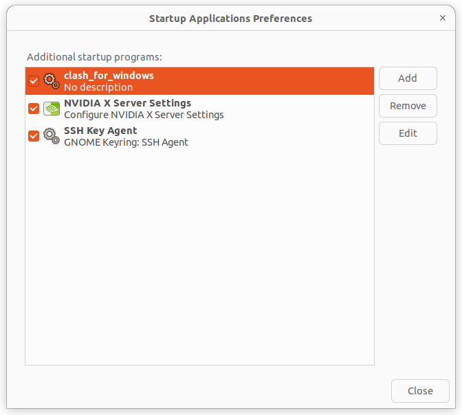
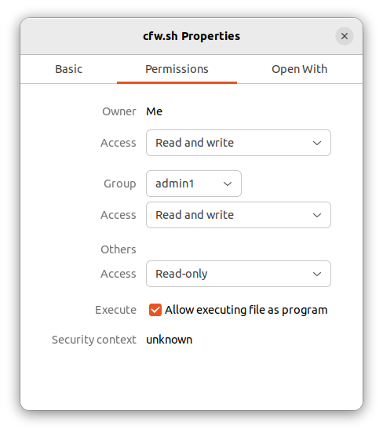

# 显卡驱动


# 常用软件

下载.deb文件，然后使用dpkg进行安装

```bash
sudo dpkg -i {deb_file}
```


## Pycharm

前往官网下载好安装包，解压后

```bash
cd pycharm-community-2022.3.2/bin/

./pycharm.sh
```


## Anaconda

下载好安装包，用`bash`安装

```bash
bash ./Anaconda3-2022.10-Linux-x86_64.sh
```


## VS Code

最开始在`ubuntu software`中安装，但安装好之后输入不了中文，于是又重新去官网用`.deb`的方式下载安装。

首先安装`gcc，g++，gdb`

```bash
# 1.更新
sudo apt-get update

# 2.下载gcc,g++,gdb
sudo apt-get install gcc
sudo apt-get install g++
sudo apt-get install gdb

# 3.检查
gcc --version
g++ --version
```

然后配置`.vscode/launch.json`和`.vscode/tasks.json`


上面是装错了，装成22.04的操作

后面换成20.04，系统自带有gcc，g++

直接安装vscode，

在`Extension`中下载好c++


# Googlepinyin

```bash
# 1.安装Fcitx
sudo apt-get install fcitx

# 2.配置Fcitx
im-config

# 3.重启
reboot

# 4.安装googlepinyin
sudo apt-get install fcitx-googlepinyin

# 5.配置输入法，没有自动加入的话，点击添加，拉到最下面
fcitx-config-gtk3
```

最后如果没有，重启一下就好了

具体参考链接：http://t.csdn.cn/K8bae

配置Fcitx的时候，选择：




# Clash for Windows

## 1.Install

**配置手动的代理**



最开始发现，v0.20.16 and v0.19.26都没用

出现问题：

```bash
/bin/sh: 1: kill: No such process

[4421:0222/103444.847045:ERROR:ssl_client_socket_impl.cc(997)] handshake failed; returned -1, SSL error code 1, net_error -101
```

随后换成v0.19.16

第一次启动没有用，只有左上角的流量监控和代理里边的延迟列表。

然后：



就可以用了，具体为什么解决无法分析，可能是因为这段时间外网被墙了？

并不是`sudo`或者`su`的原因，后续在新终端中开启也可以使用。


如果第二次启动还没有，那就尝试重启电脑，实验室的工作站就是这样有效的。

ubuntu 20.04 + clash for windows 20.21有时候也可以。

## 2.Setting

```bash
# 添加开机自启动
gnome-session-properties
```



通过add，添加写好的`cfw.sh`

```bash
#! /bin/bash

cd Software/Clash

./cfw
```

别忘了给cfw.sh添加权限，`Allow executing file as program`。




# Cuda and Cudnn

在此之前保证显卡驱动已经安装好了，即cuda driver，然后再安装cuda toolkit和cudnn


cuda参考：https://zhuanlan.zhihu.com/p/122286055

cudnn参考：http://t.csdn.cn/krk4M

## Cuda

### 1. Install

```bas
sudo chmod +x {cuda_your_version.run}
sudo ./{cuda_your_version.run}
```

出现下面这个错误，重装后没有gcc

```bas
Failed to verify gcc version. See log at /var/log/cuda-installer.log for details.
```

***（后来发现，自己装的是22.04，重装了一个20.04，系统自动安装有9.4.0的gcc和g++）***

利用--override关键字强行安装

```ba
sudo ./{cuda_your_version.run} --override
```

### 2. Setting

打开.bashrc文件

```bash
sudo gedit ~/.bashrc
```

在最后插入：**（根据不同cuda版本进行修改）**

```bash
export PATH="/usr/local/cuda-11.3/bin:$PATH"
export LD_LIBRARY_PATH="/usr/local/cuda-11.3/lib64:$LD_LIBRARY_PATH"
```

保存后，source一下

```bash
source ~/.bashrc
```

检查是否安装成功

```bash
nvcc -V
```

## Cudnn

下载好cudnn（版本和cuda对应匹配），进行解压，得到一个`cuda`的文件夹

```bash
tar -zxvf cudnn-11.3-linux-x64-v8.2.1.32.tgz
```

然后将`cuda`文件夹下的文件对应复制到`/usr/local/cuda-11.3/lib64/`和`/usr/local/cuda-11.3/include/`中

```bash
sudo cp cuda/lib64/* /usr/local/cuda-11.3/lib64/
sudo cp cuda/include/* /usr/local/cuda-11.3/include/
```

最后检查一下：

```bash
cat /usr/local/cuda-11.3/include/cudnn_version.h | grep CUDNN_MAJOR -A 2
```


